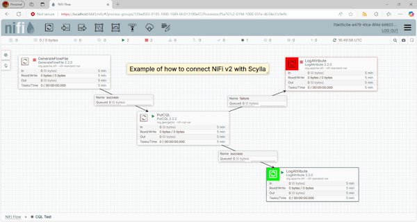

# Ff2Cql

A simple transfer data between NiFi and CQL (support Apache Cassandra, 
ScyllaDB, AstraDB, etc.). The implementation details:
 - development NiFi v2 processor (with controller) and java application (support Java 17/21+)
 - support Apache Cassandra v4/v5, ScyllaDB, AstraDB based on CQL (Cassandra Query Language)

## 1. The main motivation

 - the Apache NiFi v2 does not support Apache Cassandra v4/v5 (NiFi v2 removed 
   the Cassandra processor due to security vulnerabilities and unmaintained 
   code. The processor supported only Cassandra v3 not newer.)

## 2. Usage in NiFi

You can use this preferred way (NiFi v2 processor with controller):
 - ✅ [**PutCQL**](./nifi/cql-processor/docs/README.md#3-putcql-nifi-processor), where inputs are FlowFiles 
 - ✅ [**GetCQL**](./nifi/cql-processor/docs/README.md#4-getcql-nifi-processor), where outputs are FlowFiles
 - NOTE: You can download the [latest version](./nifi/cql-processor/output/), see 'nifi-cql-nar-*.nar' file 

or two other older alternative ways:
 - ✅ [**ExecuteProcess**](./console_app/Ff2Cql/docs/README.md#2-executeprocess-java-application) with java application (see 'Ff2Cql-*.jar'), where inputs are CSV files 
 - ✅ [**ExecuteStreamCommand**](./console_app/Ff2Cql/docs/README.md#3-executestreamcommand-java-application) with java application (see 'Ff2Cql-*.jar'), where inputs are FlowFiles via stdin

## 3. Connection setting

You can see sample of relevant setting for CQL controller here:
 - [Cassandra setting](./nifi/cql-processor/nifi-cql/src/test/test-cassandra.json)
   - access with IP addresses (name/password)
 - [Scylla setting](./nifi/cql-processor/nifi-cql/src/test/test-scylla.json)
   - access with IP address (without name/password)
 - [AstraDB setting](./nifi/cql-processor/nifi-cql/src/test/test-astra.json)
   - access with Security Connection Bundle (SCB) and Token
   - NOTE about SCB: see the file with **'.zip'** suffix
     - How to get the SCB? Go to the https://astra.datastax.com/...,
       Menu Databases/Your database/Region/[Download SCB](./docs/assets/astradb-download-SCB.png)
   - NOTE about token: see the file with **'token.json'** suffix
     - How to get the token? Go to the https://astra.datastax.com/...,
       Menu Tokens/Generate Token/Token Details/[Download Token Details](./docs/assets/astradb-download-token.png)
   
NOTE: 
 - These connection settings are used directly in unit tests.

## 4. Apache NiFi v2 & Scylla/Cassandra v5

